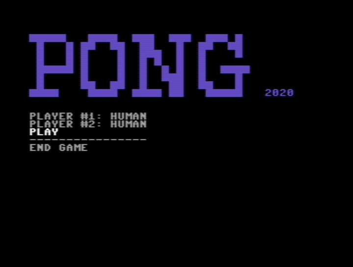
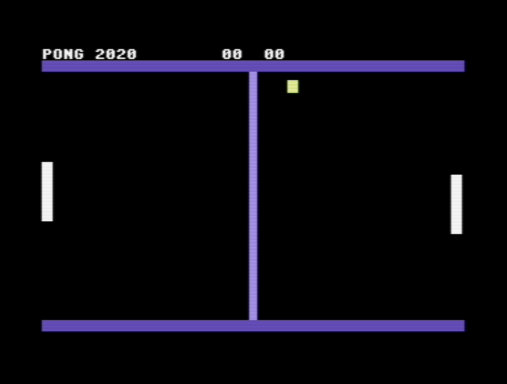

# PONG 2020

This is a tiny pong for my son.

May everyone have fun with it.

You may download the [pong2020.prg](https://github.com/maxdoom-com/c64-pong2020/blob/main/pong2020.prg?raw=true) directly.

To compile the code for yourself you will need an installation of cc65.

And this is how it looks like:

